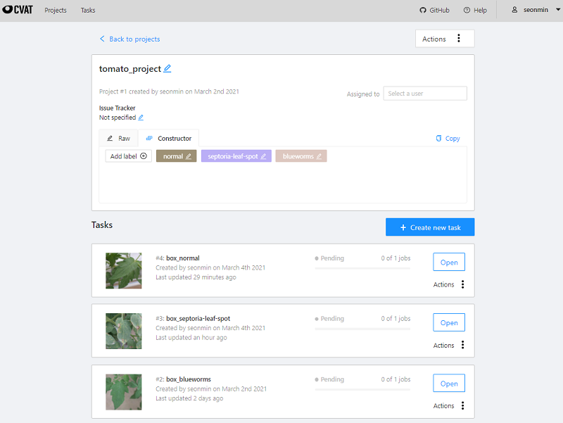
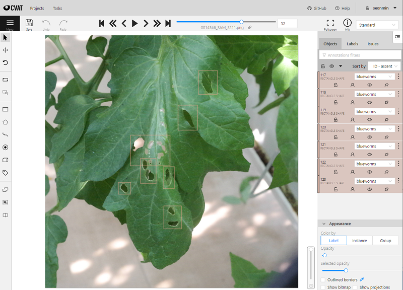

## Annotation tool

## 1. CVAT (Computer Vision Annotation Tool)
- https://github.com/openvinotoolkit/cvat
- 컴퓨터 비전 오픈 소스 웹 기반 이미지 및 비디오 Annotation 도구
- 웹 기반 툴 / Docker 기반 제공
- github 홈페이지 nstall & user guide (설명잘되있음)

### 1-1) Install (win10)
    - docker-desktop install : docker desktop 설치
    - git clone https://github.com/opencv/cvat
    - cd cvat
    - docker-compose up -d : docker-compose로 container 실행
    - winpty docker exec -it cvat bash -ic 'python3 ~/manage.py createsuperuser' : superuser 등록 (필수!!)

### 1-2) etc
- 서버 URL : loaclhost:8080
- label delete : localhost:8080/admin 접속 후 삭제
- superuser example : seonmin / rlatjsals1!

### 1-3) 사용화면

## 기타 Annotation 라벨링 Tool

### 1. Image Labeling Tool
- (1) labelImg
    - https://github.com/tzutalin/labelImg
    - bounding box 정보들을 .xml 로 저장 가능
    - Python 및 Pyqt 기반의 프로그램
    
- (2) LabelMe
    - https://github.com/wkentaro/labelme
    - MIT 컴퓨터 과학 및 인공 지능 연구소에서 만든 프로젝트로 주석과 함께 디지털 이미지의 데이터 세트를 제공
    - Rectangle, Polygon, Line, Point등 다양한 형태의 도형 labeling 지원

- (3) Labelbox
    - artificial intelligence applications을 만들기 위한 데이터 라벨링 툴
    - labeling 결과를 csv, json 뿐만 아니라 일반적으로 많이 사용하는 데이터셋의 format(COCO, VOC, TFRecord) 등으로 export할 수 있음
    
- (4) YOLO Mark
    - https://github.com/AlexeyAB/Yolo_mark
    - Yolo v3 / Yolo v2 학습하는 데 주로 쓰임
    
- (5) OpenLabeling
    - https://github.com/Cartucho/OpenLabeling
    - YOLO v2 포맷에 에 필요한 학습 데이터 세트를 만들기 위한 Open Source labeling tool
    
### 2. Video Labeling Tool
- (1) UltimateLabeling
    - https://github.com/alexandre01/UltimateLabeling
    - 통합 된 SOTA 검출기 및 추적기를 갖춘 Python의 다목적 비디오 라벨링 GUI
    - PyQt5를 사용하여 개발

## 참고 문헌
- https://kdj1018.tistory.com/entry/%EA%B8%B0%EC%88%A0-%EB%8D%B0%EC%9D%B4%ED%84%B0-%EB%9D%BC%EB%B2%A8%EB%A7%81-%ED%88%B4-for-Machine-Leraning
- https://m.blog.naver.com/PostView.nhn?blogId=jws2218&logNo=221922574525&categoryNo=1&proxyReferer=https:%2F%2Fwww.google.com%2F